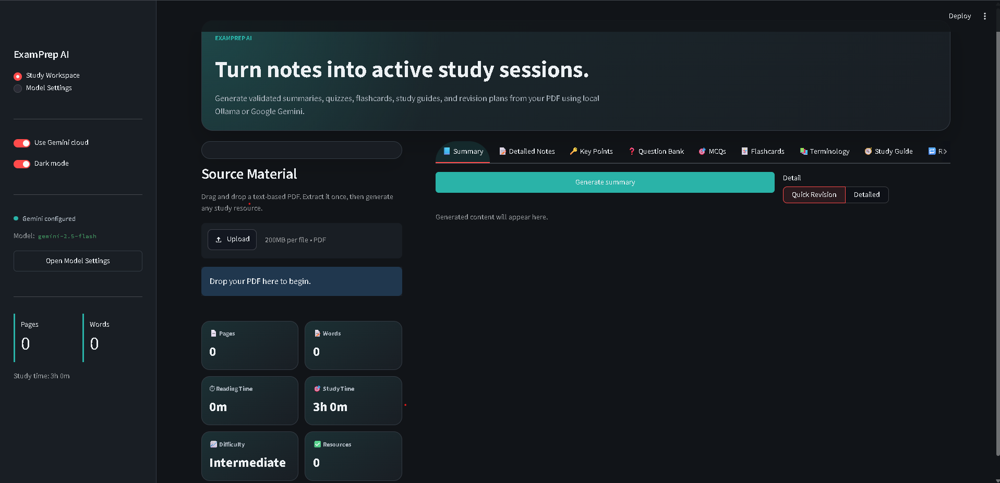
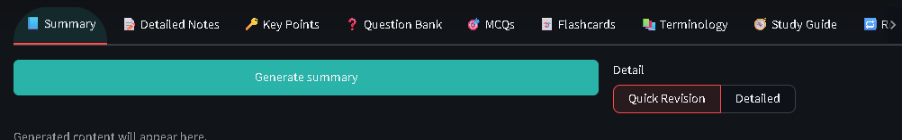
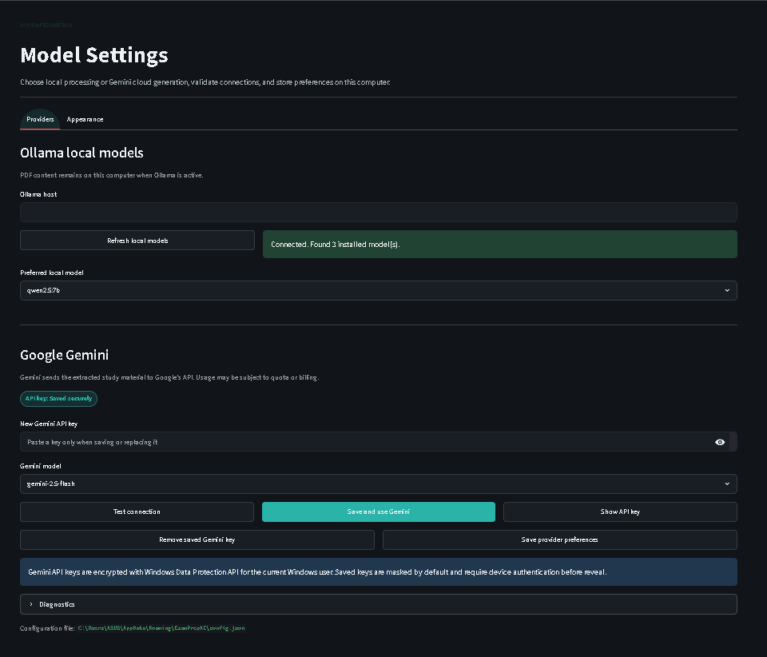

# 📚 ExamPrep AI

> A Streamlit-powered study assistant that converts text-based PDF notes into interactive exam preparation resources using local Ollama models or Google Gemini.


---

## 📌 Overview

ExamPrep AI is a local-first educational application designed to turn long PDF study material into structured, interactive revision tools. Instead of reading notes passively, students can generate summaries, MCQs, question banks, flashcards, terminology lists, study guides, revision sheets, and study plans from a single uploaded PDF.

The project solves a common exam-preparation problem: students often have large notes but limited time to convert them into practice material. ExamPrep AI extracts text from PDFs, sends the material to a selected AI provider, validates the response as structured JSON, and renders the result as learner-friendly interfaces rather than raw AI text.

The application supports two AI workflows. For private/offline usage, it integrates with locally installed Ollama models. For cloud generation, it supports Google Gemini with secure local API-key storage, model selection, connection testing, retry logic, and fallback models.

Major capabilities include local model discovery, Gemini reliability handling, exact-count validation for generated resources, interactive MCQ quizzes, flip-style flashcards, study-plan timelines, PDF/TXT/DOCX/Markdown exports, and a polished Streamlit dashboard.

---

## ✨ Features

### 🔐 Authentication & User Management

- No user registration, login, or multi-user account system is implemented.
- The app is designed as a single-user local Streamlit application.
- Provider preferences and theme settings are stored locally on the user's machine.
- Gemini API keys are stored locally for the current Windows user using Windows Data Protection API.

### 🧠 Core Features

- Upload and process text-based PDF notes.
- Extract selectable PDF text with page count and word count.
- Generate structured study resources from extracted PDF content.
- Validate AI output before rendering it in the UI.
- Retry malformed AI responses using repair prompts.
- Compare outputs across models from the active AI provider.
- Export generated material as Markdown, TXT, DOCX, and PDF.

### 👩‍🎓 User Features

- Modern study dashboard with pages, words, reading time, estimated study time, difficulty, and generated resource count.
- Interactive Summary renderer with overview, key concepts, definitions, exam points, and quick revision.
- Searchable Question Bank with expandable question cards, difficulty filtering, copy button, and selected export.
- MCQ quiz mode with answer submission, feedback, explanations, score tracking, progress bar, and incorrect-answer review.
- Interactive Flashcards with flip action, previous/next controls, shuffle, difficult-card marking, progress tracking, and keyboard navigation.
- Searchable Terminology glossary.
- Study Guide and Revision renderers with structured learning sections.
- Study Plan timeline with completion checkboxes and progress visualization.
- Light and dark theme support.

### 🛠️ Admin Features

- No administrator dashboard, role management, or admin-only workflow exists in this codebase.
- Model/provider configuration is available to the local user through the `Model Settings` page.
- Diagnostic logs are available locally through the settings interface.

### 🤖 AI Features

- Local AI generation through Ollama.
- Automatic discovery of installed Ollama models.
- Recommended local model selection, preferring `qwen2.5:7b` when available.
- Google Gemini generation through the `google-genai` package.
- Gemini model dropdown populated from supported models.
- Gemini connection test that checks API key, model availability, network access, and quota response.
- Gemini retry handling with exponential backoff.
- Gemini fallback chain:

```text
gemini-2.5-flash -> gemini-2.0-flash -> gemini-1.5-flash
```

- Friendly Gemini error messages for overload, quota/rate limits, invalid API keys, unavailable models, and network timeouts.
- Structured prompt templates for every output type.
- JSON extraction, normalization, validation, and repair prompt handling.

### 📊 Analytics & Reporting

- PDF-level study metrics:
  - page count
  - word count
  - estimated reading time
  - estimated study time
  - generated resource count
- MCQ score and completion tracking.
- Flashcard progress tracking and difficult-card marking.
- Study-plan completion progress.
- No persistent analytics database or reporting dashboard is implemented.

### 🛡️ Security Features

- Gemini API keys are encrypted locally using Windows DPAPI.
- Saved Gemini keys are masked by default.
- Revealing a saved Gemini key requires Windows device authentication.
- API keys are not stored in the project source code.
- `.env` support is available for local configuration.
- Streamlit telemetry is disabled in `.streamlit/config.toml`.
- PDF validation checks file extension, PDF header, file size, encryption, and selectable text availability.

### 🧰 Additional Utilities

- Markdown export.
- TXT export.
- DOCX export with `python-docx`.
- PDF export with `reportlab`.
- Local diagnostic logging with rotating log files.
- Config persistence through a local JSON file.
- Input trimming for large PDF content before model requests.

---

## 🏗️ Architecture Overview

ExamPrep AI is a single-page Streamlit application with a modular Python backend layer under `src/`.

The UI layer in `app.py` manages navigation, provider selection, PDF upload, settings, generation controls, and download buttons. Dedicated renderer functions in `src/ui_renderers.py` turn validated AI payloads into interactive learning interfaces.

The AI provider layer supports two providers:

- `src/llm_service.py` connects to local Ollama models.
- `src/gemini_service.py` connects to Google Gemini, validates connections, retries failures, and falls back across supported models.

The generation layer in `src/generation.py` extracts JSON from model responses, normalizes common model mistakes, validates required fields, enforces exact output counts, and creates repair prompts when the model returns malformed data.

### 🔄 Data Flow

```text
PDF Upload
  ↓
PDF Validation + Text Extraction
  ↓
Prompt Template Selection
  ↓
Ollama or Gemini Provider
  ↓
JSON Response Extraction
  ↓
Normalization + Validation
  ↓
Interactive Renderer
  ↓
Downloads / Model Comparison
```

### Frontend

- Streamlit components, tabs, forms, buttons, metrics, expanders, file uploader, progress bars, and custom CSS.
- No separate JavaScript frontend framework is used.

### Backend

- Python modules under `src/`.
- Provider services for Ollama and Gemini.
- PDF extraction, export utilities, diagnostics, and configuration helpers.

### APIs & Services

- Ollama local service, usually at `http://localhost:11434`.
- Google Gemini API via `google-genai`.

### Database

- No SQL or NoSQL database is implemented.
- Runtime state is held in Streamlit session state.
- Persistent app preferences are stored in a local JSON config file.
- Gemini API key is stored in an encrypted local binary credential file.

---

## 🗄️ Database

This project does **not** use a relational database, ORM, migrations, or database schema.

### Local Persistence Used Instead

| Storage | Purpose | Location |
|---|---|---|
| Streamlit session state | Runtime PDF text, generated outputs, quiz progress, UI state | Memory during app session |
| JSON config | Provider, Ollama host, Gemini model, theme | `%APPDATA%\ExamPrepAI\config.json` by default |
| Encrypted credential file | Gemini API key | `%APPDATA%\ExamPrepAI\gemini_key.bin` |
| Rotating log file | Diagnostic logs | `%APPDATA%\ExamPrepAI\examprep.log` |

### Entities

There are no database tables. The main in-memory data objects are:

- PDF extraction result: text, page count, word count
- Generated output payloads: validated JSON dictionaries by resource type
- Quiz state: selected answers and submitted answers
- Flashcard state: current card index, flipped side, difficult cards
- Study-plan state: completed schedule items

---

## 📁 Project Structure

```text
NOTES_Generator/
├── .streamlit/
│   └── config.toml              # Streamlit server/browser configuration
├── src/
│   ├── __init__.py              # Package marker
│   ├── app_config.py            # Local config loading/saving
│   ├── credential_store.py      # Windows-encrypted Gemini API key storage
│   ├── diagnostics.py           # Rotating diagnostic logger
│   ├── export_utils.py          # Markdown, TXT, DOCX, and PDF exports
│   ├── gemini_service.py        # Gemini integration, retries, fallback models
│   ├── generation.py            # JSON extraction, validation, normalization, repair
│   ├── llm_service.py           # Ollama integration and local model discovery
│   ├── pdf_utils.py             # PDF validation and text extraction
│   ├── planner.py               # Study-time estimation helpers
│   ├── prompts.py               # Structured prompt templates
│   └── ui_renderers.py          # Interactive output renderers
├── app.py                       # Main Streamlit application
├── README.md                    # Project documentation
├── DEVELOPMENT_LOG.md           # Development and testing log
├── SRS.md                       # Software Requirements Specification
├── requirements.txt             # Python dependencies
├── .env.example                 # Optional local environment variables
├── .gitignore                   # Git ignore rules
├── streamlit.err.log            # Streamlit error log file
└── streamlit.out.log            # Streamlit output log file
```

### Important Responsibilities

| File | Responsibility |
|---|---|
| `app.py` | App shell, sidebar, settings page, PDF upload, generation controls, downloads |
| `src/ui_renderers.py` | Dedicated renderers for summary, questions, MCQs, flashcards, terminology, study guide, revision, and study plan |
| `src/generation.py` | Parses model responses, validates schemas, repairs malformed output |
| `src/gemini_service.py` | Google Gemini client with model loading, test connection, retries, and fallback |
| `src/llm_service.py` | Ollama client, local model list, recommended model detection |
| `src/pdf_utils.py` | PDF file validation and selectable text extraction |
| `src/export_utils.py` | Converts generated content into downloadable formats |
| `src/credential_store.py` | Encrypts/decrypts Gemini API key for the Windows user |
| `src/diagnostics.py` | Writes and reads local diagnostic logs |

---

## 🧱 Tech Stack

| Layer | Technology |
|---|---|
| Language | Python |
| Frontend | Streamlit, custom CSS, Streamlit Components |
| Backend | Python modules under `src/` |
| Database | None |
| Local Persistence | JSON config, encrypted Windows credential file, rotating log file |
| AI/API | Ollama, Google Gemini via `google-genai` |
| PDF Processing | PyPDF2 |
| Exporting | reportlab, python-docx |
| Configuration | python-dotenv, `.env.example`, `.streamlit/config.toml` |
| Deployment | Local Streamlit server |
| Build Tool | None required |

---

## 🔌 API Integration

### 🦙 Ollama

Ollama is used for local AI generation. The app discovers installed models and lets the user select a model from the sidebar or settings flow.

Integration workflow:

1. Start Ollama locally.
2. Pull at least one model.
3. App calls Ollama through the `ollama` Python package.
4. AI response is streamed back to the app.
5. Response is validated before rendering.

Recommended model:

```powershell
ollama pull qwen2.5:7b
```

Default host:

```text
http://localhost:11434
```

### ✨ Google Gemini

Gemini is used for cloud-based generation through the `google-genai` package.

Integration workflow:

1. User enters Gemini API key in Model Settings.
2. API key is saved using Windows DPAPI encryption.
3. User selects a Gemini model from a dropdown.
4. App tests key, model availability, network response, and quota response.
5. Generation requests are streamed from Gemini.
6. Temporary failures are retried with exponential backoff.
7. If the selected model fails, fallback models are attempted.

Security recommendations:

- Do not commit API keys to Git.
- Use the in-app secure key storage instead of hard-coding keys.
- Avoid using Gemini on shared computers unless you understand the local credential storage behavior.
- Prefer Ollama for private/offline study material processing.

---

## 🚀 Installation & Setup

### Prerequisites

- Python 3.10 or newer
- PowerShell on Windows
- Ollama, if using local AI
- Google Gemini API key, if using Gemini

### Setup Instructions

This local checkout does not have a Git remote configured. If you are using this as a GitHub repository, clone it from your own repository page first, then enter the project folder.

1. Open the project:

```powershell
cd D:\Codex_proj\NOTES_Generator
```

2. Create a virtual environment:

```powershell
python -m venv .venv
```

3. Activate the virtual environment:

```powershell
.\.venv\Scripts\Activate.ps1
```

If PowerShell blocks activation:

```powershell
Set-ExecutionPolicy -Scope Process -ExecutionPolicy Bypass
.\.venv\Scripts\Activate.ps1
```

4. Install dependencies:

```powershell
pip install -r requirements.txt
```

5. Configure optional environment variables:

```powershell
Copy-Item .env.example .env
```

6. Configure database:

```text
No database configuration is required.
```

7. Run migrations:

```text
No migrations are required because the project does not use a database.
```

8. Build project:

```text
No build step is required for this Streamlit application.
```

9. Start application:

```powershell
streamlit run app.py
```

10. Open the app:

```text
http://localhost:8501
```

---

## ⚙️ Environment Variables

The app loads `.env` using `python-dotenv`. No environment variable is strictly required for the app to start, because provider settings can be configured in the UI.

### Variables in `.env.example`

| Variable | Required | Default | Purpose |
|---|---:|---|---|
| `OLLAMA_HOST` | No | `http://localhost:11434` | Ollama server URL |
| `OLLAMA_MODEL` | No | `qwen2.5:7b` | Default local model if none is selected in UI |
| `MAX_INPUT_CHARS` | No | `120000` | Maximum source text sent to a model before trimming |

### Additional Supported Variable

| Variable | Required | Purpose |
|---|---:|---|
| `EXAMPREP_CONFIG_DIR` | No | Overrides the local config directory used for `config.json` |

Gemini API keys are not configured through `.env` in the current implementation. They are entered through the `Model Settings` page and encrypted locally.

---

## ▶️ Running the Project

### Development

After completing the installation and setup steps:

```powershell
cd NOTES_Generator
.\.venv\Scripts\Activate.ps1
streamlit run app.py
```

### Production-Style Local Run

The repository is configured for a local headless Streamlit server through `.streamlit/config.toml`.

```powershell
streamlit run app.py --server.headless true --server.address localhost --server.port 8501
```

### Reopening After Closing

If you closed the browser tab, open it again at:

```text
http://localhost:8501
```

If you closed the terminal window, restart the application:

```powershell
cd NOTES_Generator
.\.venv\Scripts\Activate.ps1
streamlit run app.py
```

If you are using Ollama as the AI provider, ensure the Ollama service is running before generating content:

```powershell
ollama serve
```

### Accessing the Application

Once the application starts successfully, open your browser and navigate to:

```text
http://localhost:8501
```

### Docker

Docker support is not implemented in this repository. There is no `Dockerfile` or compose file in the current codebase.

---

## 🖼️ Screenshots

### Dashboard



### Main Features



### Model Settings



---

## 🧭 Workflows

### Local Ollama Workflow

```text
Start Ollama -> Pull model -> Open app -> Upload PDF -> Extract text -> Generate resource -> Review interactive output -> Export
```

### Gemini Workflow

```text
Open Model Settings -> Save Gemini API key -> Test connection -> Select model -> Upload PDF -> Generate resource -> Validated renderer
```

### Output Validation Workflow

```text
Prompt -> AI Response -> JSON extraction -> Normalization -> Schema validation -> Repair retry if needed -> Interactive renderer
```

---

## 🔮 Future Enhancements

- OCR support for scanned PDFs.
- Persistent user accounts and saved study sessions.
- Optional database layer for storing generated resources.
- Admin dashboard for classroom or institution use.
- Full Docker packaging.
- Cloud deployment profile.
- More export formats, such as Anki decks or CSV.
- Better keyboard shortcuts across all study modes.
- Topic-level PDF chunking and chapter selection.
- Automated test suite with unit and integration tests.

---

## 🤝 Contributing

Contributions are welcome if this project is published as a public repository.

Suggested workflow:

1. Fork the repository.
2. Create a feature branch.
3. Make focused changes.
4. Run validation:

```powershell
.\.venv\Scripts\python.exe -m compileall app.py src
```

5. Test the app locally:

```powershell
streamlit run app.py
```

6. Open a pull request with a clear description.

Please keep generated files, API keys, local logs, and virtual environments out of commits.

---

## 📄 License

This project was developed for educational and academic purposes as part of the Summer Internship in Applied AI & Industry AI Tools.
---

## 👤 Author

| Field | Details |
|---|---|
| Author Name | Suranjeet Behera |
| GitHub Profile | https://github.com/suran-jeet |
| LinkedIn | https://www.linkedin.com/in/suranjeet-behera |
